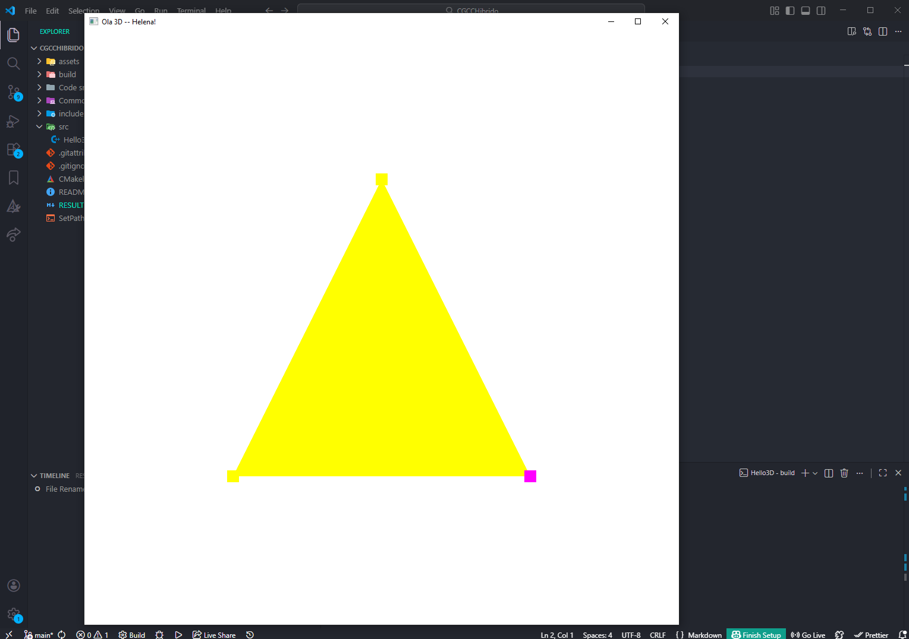

# Computação Gráfica - Híbrido

## Tarefa 1 
`Hello3D.cpp`

## Tarefa 2
`Cube.cpp`
- Alterado a geometria para um cubo
- Alterado cores: cada face tem uma cor e cada triangulo uma variação de tom
- Alterada rotação: trocado para float para poder rotacionar até nos 3 eixo ao mesmo tempo
- Adicionado translação: A e D move no eixo X, W e S no eixo Y e I e J no eixo Z
- Adicionado controle de escala: Q diminui a escala e E aumenta
- Adicionado outro cubo na cena: criado um Struct Cube, cada cubo tem sua instância com VAO, posição e escala inicial

