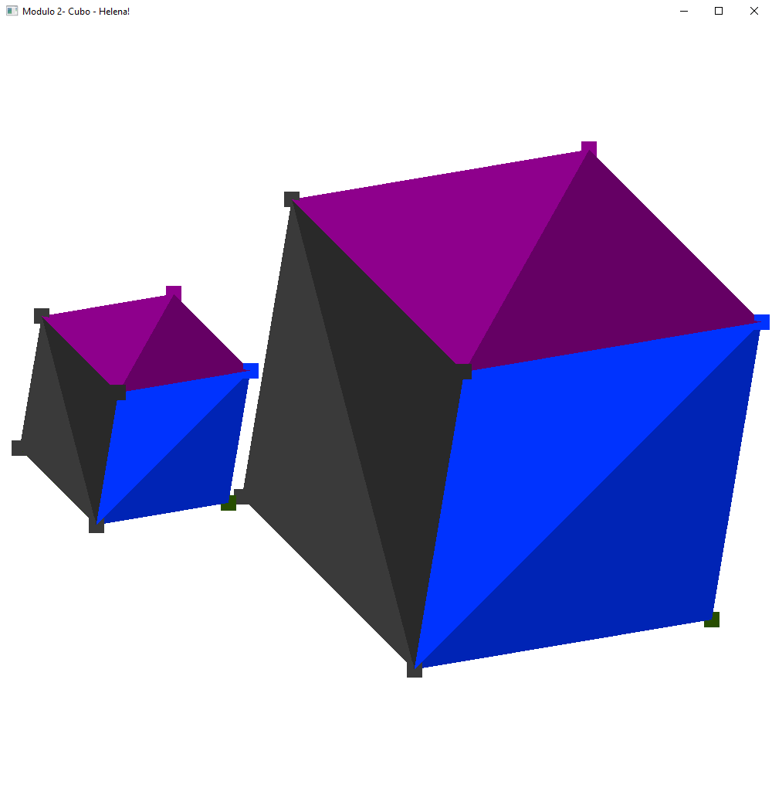
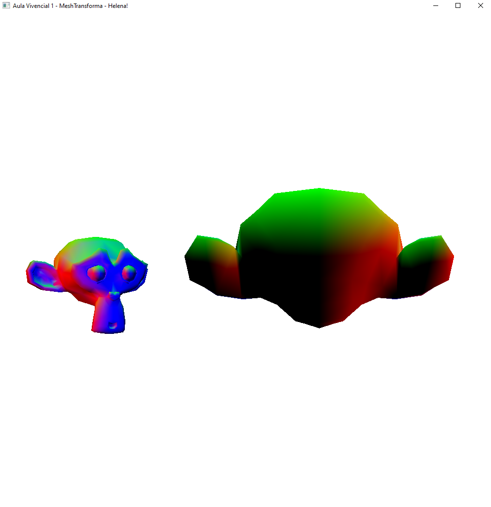
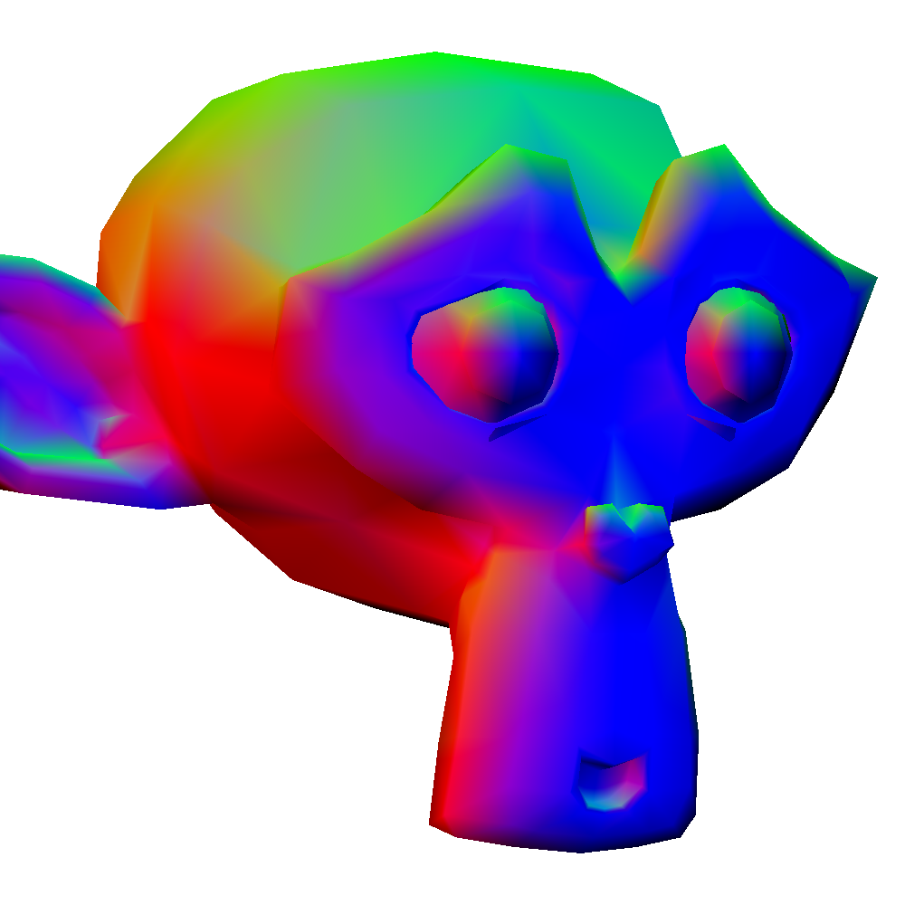
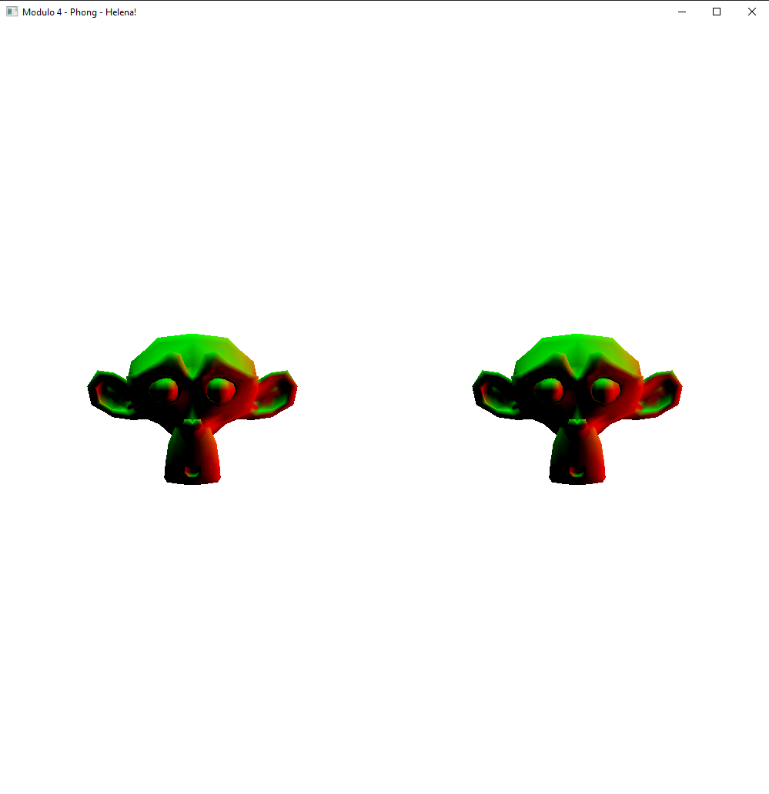

# Computação Gráfica - Híbrido

## Tarefa 1  `Hello3D.cpp`

## Tarefa 2  `Cube.cpp`  

- Alterado a geometria para um cubo
- Alterado cores: cada face tem uma cor e cada triangulo uma variação de tom
- Alterada rotação: trocado para float para poder rotacionar até nos 3 eixo ao mesmo tempo
- Adicionado translação: A e D move no eixo X, W e S no eixo Y e I e J no eixo Z
- Adicionado controle de escala: Q diminui a escala e E aumenta
- Adicionado outro cubo na cena: criado um Struct Cube, cada cubo tem sua instância com VAO, posição e escala inicial

## Vivencial 1 `MeshTransform.cpp`

- Leitura de arquivos .OBJ
- Exibir mais de um objeto na tela
- Seleção dos objetos, a partir de uma tecla (1 e 2) (0 remove a seleção)
- Aplicação de transformações no objeto selecionado:
    - Rotacionar (R) nos eixos x, y e z: Rotaciona em enquanto pressionando X, Y e Z
    - Transladar (T) nos eixos x, y e z: Move ao clicar em WASD e TG
    - Aplicar escala (S): uniforme usando Q e E e por eixo usando UI, JK e NM para os eixos x, y e z, respectivamente

## Tarefa 3  `Mesh.cpp` 

- Carregado arquivo .obj pelo loadSimpleOBJ
- Adicionado atributos de normais e coordenadas de textura (s t) ao VAO
- Renderizado objeto carregado
- Lido nome do arquivo de textura do material (.mtl) do objeto

## Tarefa 4  `Phong.cpp` 

- Carregado as informações dos vetores normais dos vértices no arquivo .OBJ (vn). 
- Recuperar os coeficientes de iluminação ambiente, difusa e especular do arquivo de materiais (.mtl), que serão enviados pela aplicação para o fragment shader, onde calcularemos sua contribuição para a cor do pixel.

